# Red Wine Quality

[Link](https://github.com/mattiapezzotti/redWine_ML) alla repo del progetto su Github.
[Link](https://docs.google.com/presentation/d/1yS_XVYV8o1SeP-sSjj_MmTjzXpVmW0dQCYPWyuINcmc/edit?usp=sharing) alla presentazione.


## Membri del Gruppo
Il Gruppo è formato da:
- Mattia Pezzotti (885965) - m.pezzotti3@campus.unimib.it
- Thomas Howard-Grubb (869248) - t.howardgrubb@campus.unimib.it
- Alaa Eddine Ghanimi (856573) - a.ghanimi@campus.unimib.it

## Introduzione al Dataset
[Link](https://www.kaggle.com/datasets/uciml/red-wine-quality-cortez-et-al-2009) al dataset su Kaggle.

Il dataset Red Wine Quality comprende una serie di proprietà fisiche e chimiche che rappresentano le caratteristiche dei vini rossi e che vengono utilizzate per determinarne la qualità.

Il dataset è relativo alla variante rossa del vino portoghese "Vinho Verde"; è stato chiesto a diversi esperti di valutare diverse tipologie di vino di diverse cantine e di dare un voto da 0 (pessimo) a 10 (eccellente).

Ogni osservazione contiene 11 diverse proprietà chimiche e il relativo punteggio di qualità.

## Variabili
**Acidità Fissa**: influenza il sapore del vino. Una riduzione significativa degli acidi può portare a vini dal sapore piatto. Esempi di acidi fissi sono il tartarico, il malico, il citrico e il succinico, che si trovano nell'uva (tranne il succinico). Si misura in g/dm3.

**Acidità Volatile**: la quantità di acido acetico presente in un vino. Viene espressa in g/l. Secondo gli esperti, rappresenta un difetto se presenta in quantità superiore a 0,7 g/l.

**Acido Citrico**: La quantità di acido citrico presente nel vino, la cui maggior parte viene solitamente consumata durante il processo di fermentazione. Agisce come conservante e piccole quantità possono aggiungere freschezza e sapore. Si misura in g/l.

**Residuo Zuccherino**: La quantità di zucchero che rimane al termine della fermentazione più quello che viene aggiunto (se viene aggiunto). L'obiettivo è ottenere un perfetto equilibrio tra dolcezza e asprezza. Si misura in g/l. I vini con più di 50 g/l sono considerati *dolci*, sotto i 10 g/l sono considerati *secchi*.

**Cloruri**: La quantità di sale presente nel vino in g/l.

**Anidride Solforosa Libera**: La quantità di anidride solforosa (SO2) in forma libera. Una quantità eccessiva è indesiderabile e dà un odore pungente. Si misura in g/dm3.

**Anidride Solforosa Totale**: La quantità totale di SO2 nel vino. Viene aggiunta per uccidere i batteri nocivi e preservare la qualità e la freschezza. Si misura in mg/l ed è regolamentata dallo Stato.

**Densità**: Si usa come misura della conversione dello zucchero in alcol. I vini più dolci hanno una densità maggiore.

**Ph**: Descrive il grado di acidità o basicità di un vino su una scala che va da 0 (molto acido) a 14 (molto basico).

**Solfiti**: La quantità di sali minerali contenenti zolfo nel vino. È un additivo che può contribuire ai livelli di anidride solforosa (S02) e agisce come antimicrobico e antiossidante. Sono legati al processo di fermentazione e influenzano l'aroma e il sapore del vino.

**Gradazione Alcoolica**: L'alcol si forma come risultato della conversione dello zucchero da parte del lievito durante il processo di fermentazione. Viene solitamente misurato in % di volume o in volume alcolico (ABV).

**Qualità**: Valutazione di qualità che va da 0 (pessimo) a 10 (eccellente). È la mediana di almeno tre valutazioni effettuate da esperti di vino su quel vino.

## Prima esplorazione
Esploriamo il dataset:

```python
df.head(10)
```

| # | fixed acidity | volatile acidity | citric acid | residual sugar | chlorides | free sulfur dioxide | total sulfur dioxide | density | pH   | sulphates | alcohol | quality |
|:-:|:-------------:|:----------------:|-------------|----------------|-----------|---------------------|----------------------|---------|------|-----------|---------|---------|
| 0 |      7.4      |       0.70       |     0.00    |       1.9      |   0.076   |         11.0        |         34.0         |  0.9978 | 3.51 |    0.56   |   9.4   |    5    |
| 1 |      7.8      |       0.88       |     0.00    |       2.6      |   0.098   |         25.0        |         67.0         |  0.9968 | 3.20 |    0.68   |   9.8   |    5    |
| 2 |      7.8      |       0.76       |     0.04    |       2.3      |   0.092   |         15.0        |         54.0         |  0.9970 | 3.26 |    0.65   |   9.8   |    5    |
| 3 |      11.2     |       0.28       |     0.56    |       1.9      |   0.075   |         17.0        |         60.0         |  0.9980 | 3.16 |    0.58   |   9.8   |    6    |
| 4 |      7.4      |       0.70       |     0.00    |       1.9      |   0.076   |         11.0        |         34.0         |  0.9978 | 3.51 |    0.56   |   9.4   |    5    |
| 5 |      7.4      |       0.66       |     0.00    |       1.8      |   0.075   |         13.0        |         40.0         |  0.9978 | 3.51 |    0.56   |   9.4   |    5    |
| 6 |      7.9      |       0.60       |     0.06    |       1.6      |   0.069   |         15.0        |         59.0         |  0.9964 | 3.30 |    0.46   |   9.4   |    5    |
| 7 |      7.3      |       0.65       |     0.00    |       1.2      |   0.065   |         15.0        |         21.0         |  0.9946 | 3.39 |    0.47   |   10.0  |    7    |
| 8 |      7.8      |       0.58       |     0.02    |       2.0      |   0.073   |         9.0         |         18.0         |  0.9968 | 3.36 |    0.57   |   9.5   |    7    |
| 9 |      7.5      |       0.50       |     0.36    |       6.1      |   0.071   |         17.0        |         102.0        |  0.9978 | 3.35 |    0.80   |   10.5  |    5    |

```python
df.info()
```
|  # |        Column        | Non-Null Count |  Dtype  |
|:--:|:--------------------:|:--------------:|:-------:|
|  0 |     fixed acidity    |  1599 non-null | float64 |
|  1 |   volatile acidity   |  1599 non-null | float64 |
|  2 |      citric acid     |  1599 non-null | float64 |
|  3 |    residual sugar    |  1599 non-null | float64 |
|  4 |       chlorides      |  1599 non-null | float64 |
|  5 |  free sulfur dioxide |  1599 non-null | float64 |
|  6 | total sulfur dioxide |  1599 non-null | float64 |
|  7 |        density       |  1599 non-null | float64 |
|  8 |          pH          |  1599 non-null | float64 |
|  9 |       sulphates      |  1599 non-null | float64 |
| 10 |        alcohol       |  1599 non-null | float64 |
| 11 |        quality       |  1599 non-null |  int64  |

```python
df.isnull().sum()
```
|  # |        Column        | Null Count |
|:--:|:--------------------:|:----------:|
|  0 |     fixed acidity    |      0     |
|  1 |   volatile acidity   |      0     |
|  2 |      citric acid     |      0     |
|  3 |    residual sugar    |      0     |
|  4 |       chlorides      |      0     |
|  5 |  free sulfur dioxide |      0     |
|  6 | total sulfur dioxide |      0     |
|  7 |        density       |      0     |
|  8 |          pH          |      0     |
|  9 |       sulphates      |      0     |
| 10 |        alcohol       |      0     |
| 11 |        quality       |      0     |

Il dataset non presenta elementi nulli.

```python
df.duplicated().sum()
``` 
```cmd
240
``` 

Questo significa che ci sono 240 entry duplicate, questo tuttavia non significa che i dati siano inutili, semplicemente ci dice che in quelle osservazioni diversi giudici hanno dato lo stesso voto di qualità a uno stesso vino.

```python
df.describe().T
``` 

|                      |  count |    mean   |    std    | min     | 25%     | 50%      | 75%       | max       |
|:--------------------:|:------:|:---------:|:---------:|---------|---------|----------|-----------|-----------|
|     fixed acidity    | 1599.0 |  8.319637 | 1.741096  | 4.60000 | 7.1000  | 7.90000  | 9.200000  | 15.90000  |
|   volatile acidity   | 1599.0 |  0.527821 | 0.179060  | 0.12000 | 0.3900  | 0.52000  | 0.640000  | 1.58000   |
|      citric acid     | 1599.0 |  0.270976 | 0.194801  | 0.00000 | 0.0900  | 0.26000  | 0.420000  | 1.00000   |
|    residual sugar    | 1599.0 |  2.538806 | 1.409928  | 0.90000 | 1.9000  | 2.20000  | 2.600000  | 15.50000  |
|       chlorides      | 1599.0 |  0.087467 | 0.047065  | 0.01200 | 0.0700  | 0.07900  | 0.090000  | 0.61100   |
|  free sulfur dioxide | 1599.0 | 15.874922 | 10.460157 | 1.00000 | 7.0000  | 14.00000 | 21.000000 | 72.00000  |
| total sulfur dioxide | 1599.0 | 46.467792 | 32.895324 | 6.00000 | 22.0000 | 38.00000 | 62.000000 | 289.00000 |
|        density       | 1599.0 |  0.996747 | 0.001887  | 0.99007 | 0.9956  | 0.99675  | 0.997835  | 1.00369   |
|          pH          | 1599.0 |  3.311113 | 0.154386  | 2.74000 | 3.2100  | 3.31000  | 3.400000  | 4.01000   |
|       sulphates      | 1599.0 |  0.658149 | 0.169507  | 0.33000 | 0.5500  | 0.62000  | 0.730000  | 2.00000   |
|        alcohol       | 1599.0 | 10.422983 | 1.065668  | 8.40000 | 9.5000  | 10.20000 | 11.100000 | 14.90000  |
|        quality       | 1599.0 |  5.636023 | 0.807569  | 3.00000 | 5.0000  | 6.00000  | 6.000000  | 8.00000   |

Notiamo subito che, nonostante i voti potessero essere da 0 a 10, esistono solo voti tra il 3 e l'8. Analizziamo meglio *quality*.

### Studio della qualità
    
```python
df["quality"].value_counts()
``` 

| quality | count |
|:-------:|-------|
|    3    | 10    |
|    4    | 53    |
|    5    | 681   |
|    6    | 638   |
|    7    | 199   |
|    8    | 18    |


Come vediamo, c'è un forte **central bias**, i giudici non si esponevano troppo nelle loro valutazioni e tendevano a giudicare con un valore centrale.
Per questo possiamo dire che un vino è **Buono** se è di qualità *6.5* o superiore.

Possiamo studiare la qualità in due modi:
- *Singolarmente*, quindi utilizzando i valori originali
- *Categorizzando*, avendo solo 6 qualità contigue, possiamo unire a due a due, trasformando la qualità in "scadente" (3-4), "normale" (5-6), "ottimo" (7-8).

#### Studio utilizzando le sei qualità

```python
df.corr()['quality']
```

|        quality       | correlation  |
|:--------------------:|-----------|
|        alcohol       | 0.476166  |
|       sulphates      | 0.251397  |
|      citric acid     | 0.226373  |
|     fixed acidity    | 0.124052  |
|    residual sugar    | 0.013732  |
|  free sulfur dioxide | -0.050656 |
| pH                   | -0.057731 |
| chlorides            | -0.128907 |
| density              | -0.174919 |
| total sulfur dioxide | -0.185100 |
| volatile acidity     | -0.390558 |


Notiamo che ci sono delle **forti correlazioni** tra alcuni elementi e la qualità del vino, cosa che noi non vogliamo avere.


Notiamo che ci sono notevoli **Outlier** tra alcuni elementi, cosa che noi non vogliamo avere.

#### Studio con categorie

```python
df["qualityRange"] = pd.cut(df["quality"], bins=[-np.inf, 4, 6, np.inf], labels=["3-4","5-6","7-8"])
```


## PCA
Il dataset è ovviamente di grande dimensioni (11), cerchiamo di trovare quali sono effettivamente utili cosi da ridurne la complessità.
Per evitare che le correlazioni tra variabili possano influenzare i risultati, prima di applicare PCA, standardizziamo i risultati e riduciamo la dimensione del dataset.

```python
scaler = StandardScaler()
scaled_data = scaler.fit_transform(df[columns])

x_train, x_test, y_train, y_test = train_test_split(scaled_data, qualityColumn, test_size = 0.25, random_state=42)

pca = PCA(n_components=None)
    
x_train = pca.fit_transform(x_train)
x_test = pca.transform(x_test)
explained_variance = pca.explained_variance_ratio_
```

La **explained variance** è quindi:

```python
[0.27590, 0.17191, 0.13659, 0.11815, 0.09029, 0.06029, 0.05433, 0.03969, 0.031056, 0.01621, 0.00555]
```

Studiando i risultati in un grafico:


Vediamo come non tutte le componenti sono fondamentali per lo studio della qualità del vino, potendo quindi ridurre le componenti da 11 a 8.

```python
newDF = PCA(n_components=8).fit_transform(scaled_data)
```

# Previsione quality usando DecisionTree e SVM

Possiamo utilizzare il lavoro svolto fino ad ora per allenare dei modelli che riescano a prevedere se un vino è "good" (quality da 7-8) o "bad" (quality da 3-6).
##Scelta di DecisionTree e SVM

## Preparazione dataframe

Come primo step dobbiamo aggiungere al dataframe pcaData l'attributo qualityRange:
```python
quality_mapping = {
    3: "bad",
    4: "bad",
    5: "bad",
    6: "bad",
    7: "good",
    8: "good"
}

df["qualityRange"] = quality_df["quality"].map(quality_mapping).astype('category')
newdf = pd.concat([pcaData, df['qualityRange']], axis=1)
```
Così facendo otteniamo newdf che rappresenta pcaData con l'aggiunta del nuovo attributo "qualityRange".

### Primo allenamento DecisionTree
Se proviamo ad allenare un modello DecisionTree come segue:

```python
from sklearn.tree import DecisionTreeClassifier
from sklearn.model_selection import train_test_split
from sklearn.metrics import classification_report

X = newdf.iloc[:, :-1]
y = newdf['qualityRange']

X_train, X_test, y_train, y_test = train_test_split(X, y, test_size=0.26, random_state=42)

tree_classifier = DecisionTreeClassifier(random_state=10)

tree_classifier.fit(X_train, y_train)

y_pred = tree_classifier.predict(X_test)

print(classification_report(y_test, y_pred))
```

Otteniamo iseguenti risultati:


Il modello come vediamo fatica a riconoscere con precisione gli elementi di tipo "good", questo potrebbe essere dovuto a un dataset sbilanciato che va controllato ed eventualmente corretto.

### Ribilanciamento del dataframe

Eseguendo un count sui valori di "qualityRange" osserviamo che il dataframe è molto sbilanciato:


Per risolvere eseguiamo SMOTE (Synthetic Minority Over-sampling Technique) per fare oversampling. SMOTE è una tecnica statistica che permette di aumentare il numero di casi nel set di dati in modo bilanciato. Crea nuove istanze a partire da casi di minoranza esistenti.
Meglio eseguire un oversampling rispetto a undersampling in modo da non avere perdita perdita di informazione. Abbiamo scelto SMOTE perchè Non modifica il numero di casi di maggioranza e crea dati nuovi ipotetici, senza copiare quelli che già abbiamo.

```python
from imblearn.over_sampling import SMOTE

X = newdf.iloc[:, :-1]
y = newdf['qualityRange']

smote = SMOTE()
X_train_resampled, y_train_resampled = smote.fit_resample(X, y)
```

Eseguendo un count sui valori di "qualityRange" osserviamo che il dataframe ora è bilanciato:

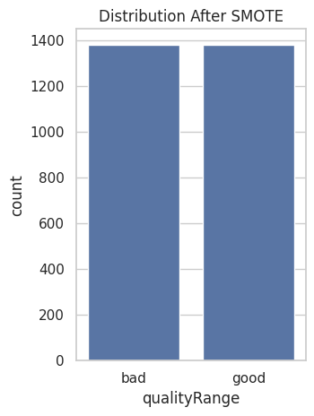

Possiamo quindi inziare ad allenare dei modelli.
## Descrizione e motivazione dei modelli di machine learning scelti

I modelli scelti per l'allenamento sono il DecisionTree e la SVM (Suport Vector Machine).

Gli alberi di decisione possono lavorare con attributi continui, come nel caso del nostro dataset. Possono inoltre catturare relazioni non lineari tra gli attributi.

Le SVM invece possono gestire anche loro lavorare con attributi continui in modo efficace. Attraverso la mappatura delle caratteristiche di input in uno spazio dimensionale superiore riescono anche loro a catturare relazioni complesse tra gli attributi.

Per l'allenamento mireremo ad avere i migliori valori AUC (Area Under Curve) possibili. Questo perchè l'accuratezza potrebbe non essere una buona metrica su un dataset sbilanciato, che il nostro come vedremo è tale.
Inoltre il valore AUC e la curva ROC tengono conto della trade-off tra tasso di vera positività e tasso di falsi positivi, una buona indicazione della performance dei nostri modelli. 
Infine le curve ROC vedremo che ci saranno utili per fare confronti diretti tra due modelli allenati.
 
## DecisionTree

Iniziamo allenando un modello di albero decisionale usando il nostro dataframe.
Divideremo il set di dati in 3 parti:
-training set
-validation set
-test set

```python
X_train, X_temp, y_train, y_temp = train_test_split(X_train_resampled, y_train_resampled, test_size=0.3, random_state=10)
X_val, X_test, y_val, y_test = train_test_split(X_temp, y_temp, test_size=0.3, random_state=10)
```
Alleniamo il DecisionTree come segue:

```python
from sklearn.tree import DecisionTreeClassifier
from sklearn.model_selection import train_test_split
from sklearn.metrics import classification_report


tree_classifier = DecisionTreeClassifier(random_state=10)

tree_classifier.fit(X_train, y_train)

y_train_pred = tree_classifier.predict(X_train)

y_val_pred = tree_classifier.predict(X_val)

y_test_pred = tree_classifier.predict(X_test)

print("Training Set Performance:")
print(classification_report(y_train, y_train_pred))

print("Validation Set Performance:")
print(classification_report(y_val, y_val_pred))

print("Test Set Performance:")
print(classification_report(y_test, y_test_pred))

```

Otteniamo i seguenti risultati:

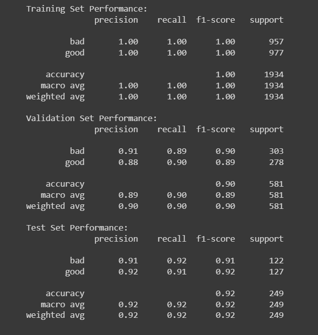


I risultati del modello sono positivi, tuttavia osservando la perfetta training set performance e la differenza abbastanza grande tra training set performance e la validation set permormance possiamo dedurre che il modello è caratterizzato da overfitting. Di conseguenza conviene trovare nuovi hyperparameters per il modello. Noi useremo GridSearch che permette di trovare gli hyperparameters ottimizzando il valore di AUC:

```python
from sklearn.tree import DecisionTreeClassifier
from sklearn.model_selection import train_test_split, GridSearchCV
from sklearn.metrics import classification_report
from sklearn.model_selection import cross_val_score
from time import time

X_train, X_temp, y_train, y_temp = train_test_split(X_train_resampled, y_train_resampled, test_size=0.3, random_state=10)
X_val, X_test, y_val, y_test = train_test_split(X_temp, y_temp, test_size=0.3, random_state=10)

tree_classifier1 = DecisionTreeClassifier()

param_grid = {
    'max_features': [ 'sqrt', 'log2'],
    'min_samples_split': [2,5,10, 15, 22,25, 24, 23, 30, 42, 50],
    'min_samples_leaf': [1, 2, 4, 5, 6, 7, 8],
    'max_depth': [None, 5, 10, 15, 20]
}

grid_search = GridSearchCV(tree_classifier1, param_grid, cv=10, scoring='roc_auc')
grid_search.fit(X_train, y_train)


best_params = grid_search.best_params_

best_tree_classifier = DecisionTreeClassifier(random_state=42, **best_params)
start_time = time()
best_tree_classifier.fit(X_train, y_train)
end_time = time()
dt_training_time = end_time - start_time


y_train_pred = best_tree_classifier.predict(X_train)

y_val_pred = best_tree_classifier.predict(X_val)

y_test_pred = best_tree_classifier.predict(X_test)


print("Training Set Performance:")
print(classification_report(y_train, y_train_pred))

print("Validation Set Performance:")
print(classification_report(y_val, y_val_pred))

print("Test Set Performance:")
print(classification_report(y_test, y_test_pred))

```
I risultati ottenuti saranno i seguenti:

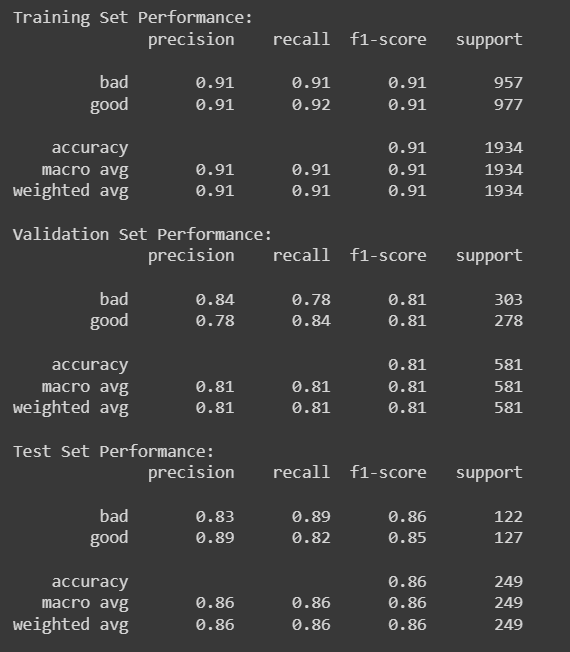

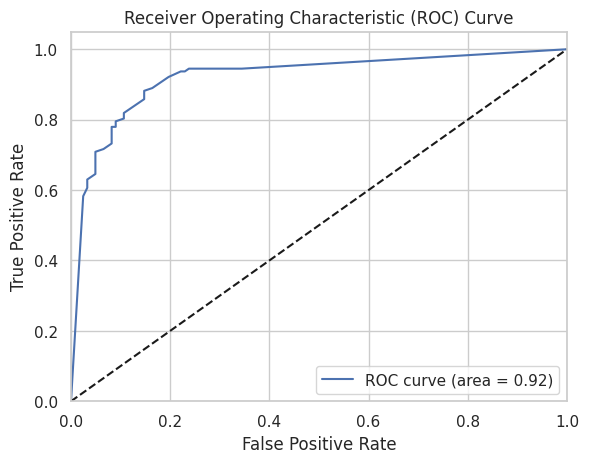

Quello che possiamo osservare è che il modello generalizza meglio il dataset.
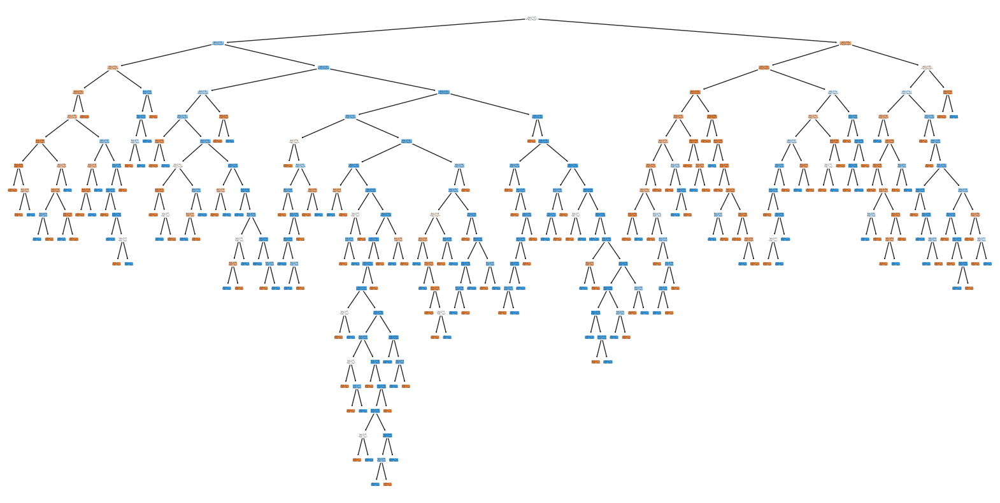 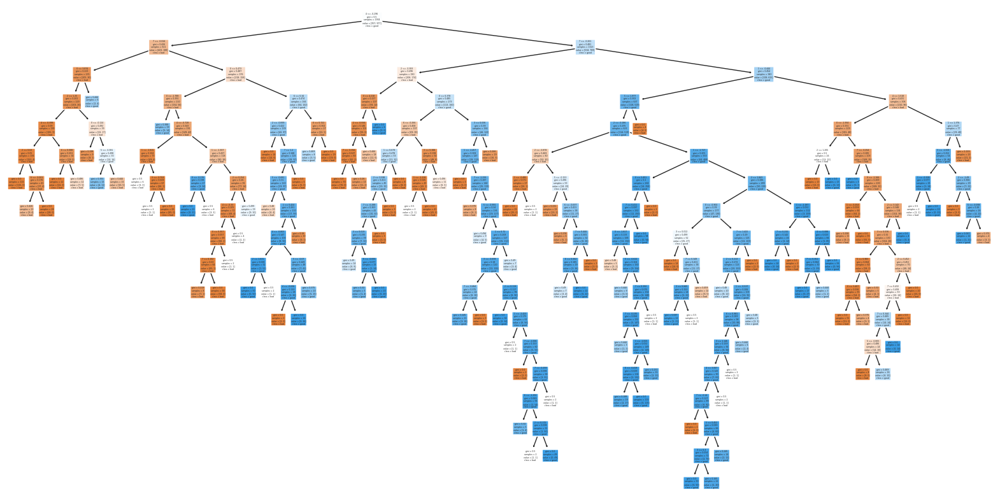

Procediamo con l'allenamento della SVM.

## SVM

Alleniamo il modello come segue:

```python
from sklearn.svm import SVC
from sklearn.metrics import classification_report

X = newdf.iloc[:, :-1]
y = newdf['qualityRange']

smote = SMOTE()
X_train_resampled, y_train_resampled = smote.fit_resample(X, y)

X_train, X_temp, y_train, y_temp = train_test_split(X_train_resampled, y_train_resampled, test_size=0.3, random_state=42)
X_val, X_test, y_val, y_test = train_test_split(X_temp, y_temp, test_size=0.3, random_state=42)

svm_classifier = SVC(random_state=42)

svm_classifier.fit(X_train, y_train)

y_train_pred = svm_classifier.predict(X_train)

print("Training Set Performance:")
print(classification_report(y_train, y_train_pred))

y_val_pred = svm_classifier.predict(X_val)

print("Validation Set Performance:")
print(classification_report(y_val, y_val_pred))

y_test_pred = svm_classifier.predict(X_test)

print("Test Set Performance:")
print(classification_report(y_test, y_test_pred))

```
I risultati che otteniamo da traing, validation e testing sono i seguenti

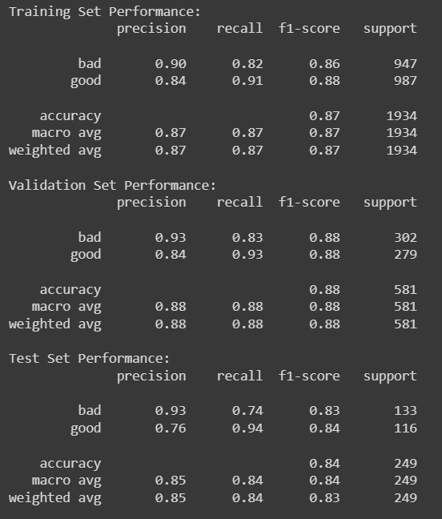

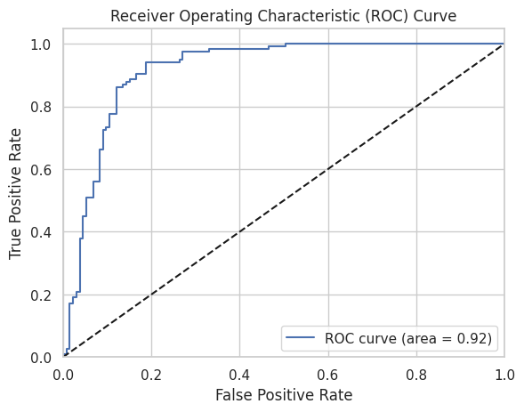

Il risultato è decisamente un buon punto di inizio, performando bene su tutti i set in modo stabile, non è presente overfitting. Tuttavia potrebbe essere migliorato applicando GridSearch:

```python
from sklearn.svm import SVC
from sklearn.model_selection import GridSearchCV
from sklearn.metrics import classification_report
from sklearn.model_selection import train_test_split
from imblearn.over_sampling import SMOTE
import pandas as pd

X = newdf.iloc[:, :-1]
y = newdf['qualityRange']

smote = SMOTE()
X_train_resampled, y_train_resampled = smote.fit_resample(X, y)

X_train, X_temp, y_train, y_temp = train_test_split(X_train_resampled, y_train_resampled, test_size=0.3, random_state=42)
X_val, X_test, y_val, y_test = train_test_split(X_temp, y_temp, test_size=0.3, random_state=42)


svm_classifier = SVC(random_state=42)

param_grid = {
    'C': [0.1, 1, 10],
    'kernel': ['linear', 'rbf', 'poly'],
    'gamma': ['scale', 'auto']
}

svm_grid = GridSearchCV(svm_classifier, param_grid, cv=3, scoring='roc_auc')

svm_grid.fit(X_train, y_train)


best_params_svm = svm_grid.best_params_
best_svm_classifier = SVC(random_state=42, **best_params_svm)

start_time = time()
best_svm_classifier.fit(X_train, y_train)
end_time = time()
svm_training_time = end_time - start_time


y_train_pred = best_svm_classifier.predict(X_train)

print("Training Set Performance:")
print(classification_report(y_train, y_train_pred))

y_val_pred = best_svm_classifier.predict(X_val)

print("Validation Set Performance:")
print(classification_report(y_val, y_val_pred))

y_test_pred = best_svm_classifier.predict(X_test)

print("Test Set Performance:")
print(classification_report(y_test, y_test_pred))


```

I risultati del nuovo allenamento sono i seguenti:

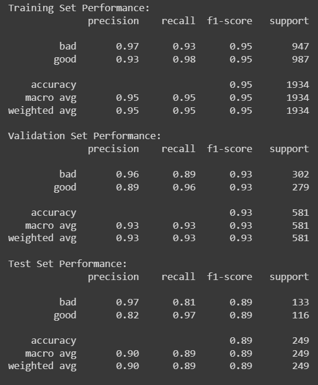

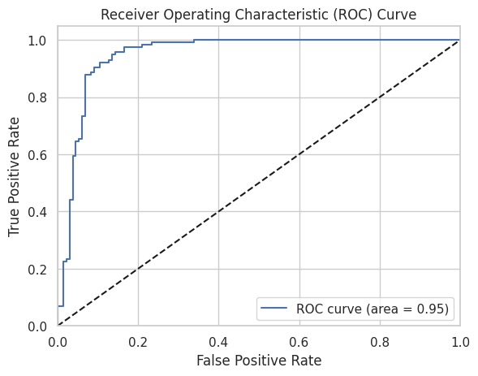

Possiamo osservare che con i nuovi parametri si ottiene un modello che mostra una performance superiore su tutti i set. Precisione, recall e F1-score sonon anche più elevati.
Valore AUC migliorato indica che il modello ha migliorato la sua capacità di discriminare tra le classi.

## Confronto tra i modelli trovati

Proviamo ora a confrontare i due modelli allenati, DecisionTree (con gridsearch) e SVM (con gridsearch):

```python

from sklearn.metrics import roc_curve, roc_auc_score
from sklearn.preprocessing import LabelEncoder
import matplotlib.pyplot as plt


fpr_grid, tpr_grid, thresholds = roc_curve(y_test_binary1, y_pred_prob1)

roc_auc_grid = roc_auc_score(y_test_binary1, y_pred_prob1)


fpr_svm, tpr_svm, thresholds2 = roc_curve(y_test_binary2, y_pred_prob2)

roc_auc_svm = roc_auc_score(y_test_binary2, y_pred_prob2)


plt.plot(fpr_grid, tpr_grid, label='Decision Tree (area = %0.2f)' % roc_auc_grid)
plt.plot(fpr_svm, tpr_svm, label='SVM (area = %0.2f)' % roc_auc_svm)

plt.plot([0, 1], [0, 1], 'k--')
plt.xlim([0.0, 1.0])
plt.ylim([0.0, 1.05])
plt.xlabel('False Positive Rate')
plt.ylabel('True Positive Rate')
plt.title('Receiver Operating Characteristic (ROC) Curve')
plt.legend(loc="lower right")
plt.show()

```

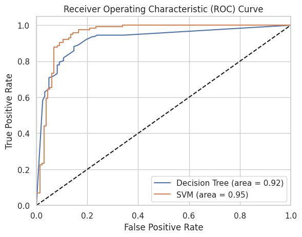

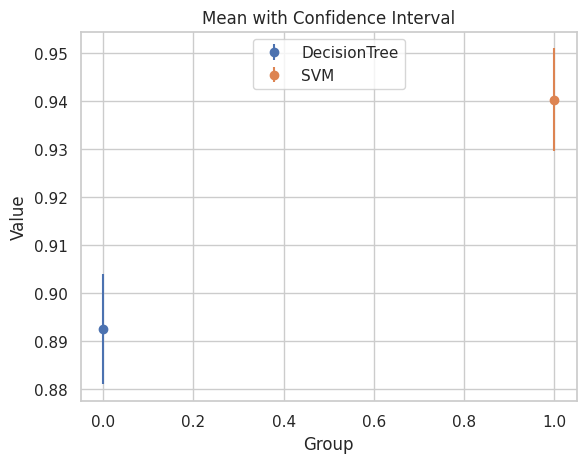

Rappresentando le curve ROC dei due modelli sullo stesso diagramma possiamo osservare come la SVM riesce a distinguere con maggiore efficacia i vini "bad" da quelli "good". Inoltre il confronto tra confidence level ci dimostra ancora come la SVM performa meglio sul dataset rispetto al DecisionTree.
Tuttavia il DecisionTree perfoma meglio a livello di tempo:

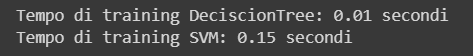

#Conclusioni
