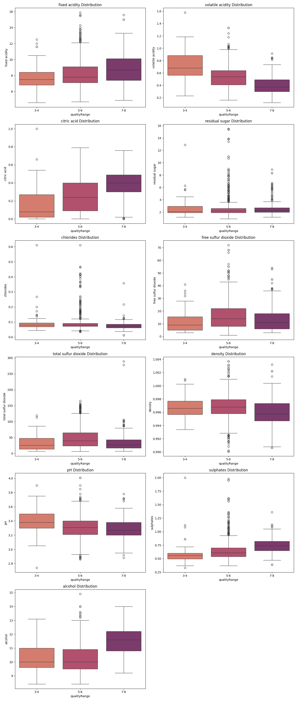
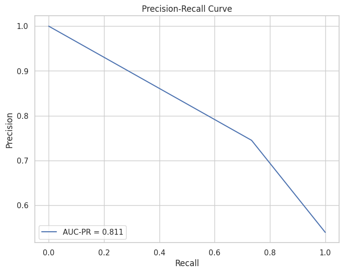
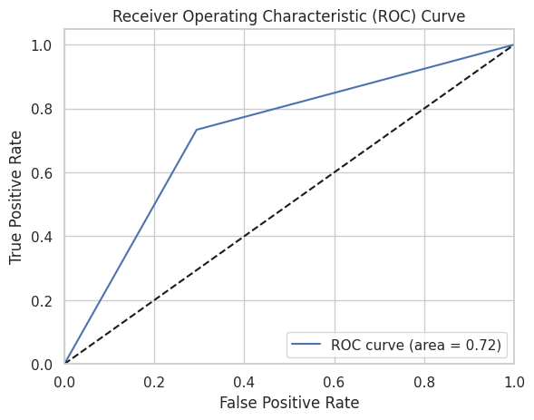
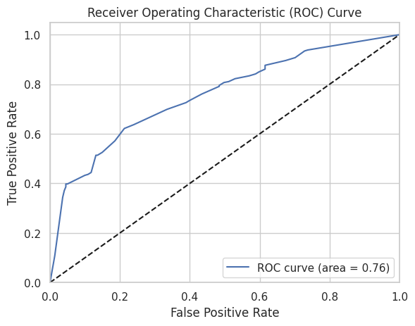
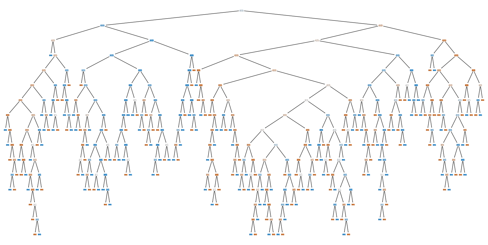
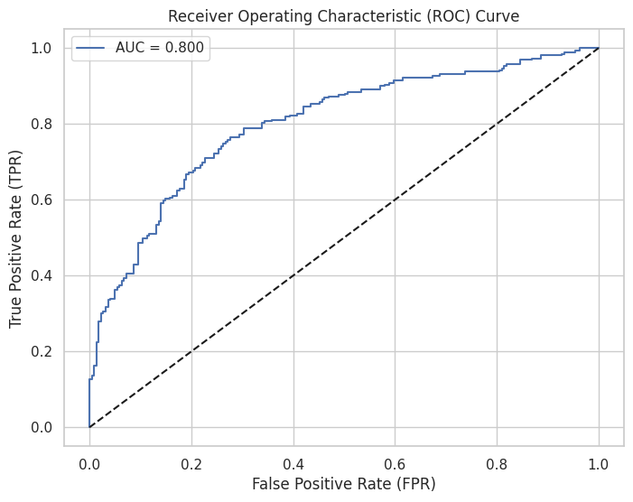

# Red Wine Quality

[Link](https://github.com/mattiapezzotti/redWine_ML) alla repo del progetto su Github.
[Link](https://docs.google.com/presentation/d/1yS_XVYV8o1SeP-sSjj_MmTjzXpVmW0dQCYPWyuINcmc/edit?usp=sharing) alla presentazione.


## Membri del Gruppo
Il Gruppo è formato da:
- Mattia Pezzotti (885965) - m.pezzotti3@campus.unimib.it
- Thomas Howard-Grubb (869248) - t.howardgrubb@campus.unimib.it
- Alaa Eddine Ghanimi (856573) - a.ghanimi@campus.unimib.it

## Introduzione al Dataset
[Link](https://www.kaggle.com/datasets/uciml/red-wine-quality-cortez-et-al-2009) al dataset su Kaggle.

Il dataset Red Wine Quality comprende una serie di proprietà fisiche e chimiche che rappresentano le caratteristiche dei vini rossi e che vengono utilizzate per determinarne la qualità.

Il dataset è relativo alla variante rossa del vino portoghese "Vinho Verde"; è stato chiesto a diversi esperti di valutare diverse tipologie di vino di diverse cantine e di dare un voto da 0 (pessimo) a 10 (eccellente).

Ogni osservazione contiene 11 diverse proprietà chimiche e il relativo punteggio di qualità.

## Variabili
**Acidità Fissa**: influenza il sapore del vino. Una riduzione significativa degli acidi può portare a vini dal sapore piatto. Esempi di acidi fissi sono il tartarico, il malico, il citrico e il succinico, che si trovano nell'uva (tranne il succinico). Si misura in g/dm3.

**Acidità Volatile**: la quantità di acido acetico presente in un vino. Viene espressa in g/l. Secondo gli esperti, rappresenta un difetto se presenta in quantità superiore a 0,7 g/l.

**Acido Citrico**: La quantità di acido citrico presente nel vino, la cui maggior parte viene solitamente consumata durante il processo di fermentazione. Agisce come conservante e piccole quantità possono aggiungere freschezza e sapore. Si misura in g/l.

**Residuo Zuccherino**: La quantità di zucchero che rimane al termine della fermentazione più quello che viene aggiunto (se viene aggiunto). L'obiettivo è ottenere un perfetto equilibrio tra dolcezza e asprezza. Si misura in g/l. I vini con più di 50 g/l sono considerati *dolci*, sotto i 10 g/l sono considerati *secchi*.

**Cloruri**: La quantità di sale presente nel vino in g/l.

**Anidride Solforosa Libera**: La quantità di anidride solforosa (SO2) in forma libera. Una quantità eccessiva è indesiderabile e dà un odore pungente. Si misura in g/dm3.

**Anidride Solforosa Totale**: La quantità totale di SO2 nel vino. Viene aggiunta per uccidere i batteri nocivi e preservare la qualità e la freschezza. Si misura in mg/l ed è regolamentata dallo Stato.

**Densità**: Si usa come misura della conversione dello zucchero in alcol. I vini più dolci hanno una densità maggiore.

**Ph**: Descrive il grado di acidità o basicità di un vino su una scala che va da 0 (molto acido) a 14 (molto basico).

**Solfiti**: La quantità di sali minerali contenenti zolfo nel vino. È un additivo che può contribuire ai livelli di anidride solforosa (S02) e agisce come antimicrobico e antiossidante. Sono legati al processo di fermentazione e influenzano l'aroma e il sapore del vino.

**Gradazione Alcoolica**: L'alcol si forma come risultato della conversione dello zucchero da parte del lievito durante il processo di fermentazione. Viene solitamente misurato in % di volume o in volume alcolico (ABV).

**Qualità**: Valutazione di qualità che va da 0 (pessimo) a 10 (eccellente). È la mediana di almeno tre valutazioni effettuate da esperti di vino su quel vino.

## Prima esplorazione
Esploriamo il dataset:

```python
df.head(10)
```

| # | fixed acidity | volatile acidity | citric acid | residual sugar | chlorides | free sulfur dioxide | total sulfur dioxide | density | pH   | sulphates | alcohol | quality |
|:-:|:-------------:|:----------------:|-------------|----------------|-----------|---------------------|----------------------|---------|------|-----------|---------|---------|
| 0 |      7.4      |       0.70       |     0.00    |       1.9      |   0.076   |         11.0        |         34.0         |  0.9978 | 3.51 |    0.56   |   9.4   |    5    |
| 1 |      7.8      |       0.88       |     0.00    |       2.6      |   0.098   |         25.0        |         67.0         |  0.9968 | 3.20 |    0.68   |   9.8   |    5    |
| 2 |      7.8      |       0.76       |     0.04    |       2.3      |   0.092   |         15.0        |         54.0         |  0.9970 | 3.26 |    0.65   |   9.8   |    5    |
| 3 |      11.2     |       0.28       |     0.56    |       1.9      |   0.075   |         17.0        |         60.0         |  0.9980 | 3.16 |    0.58   |   9.8   |    6    |
| 4 |      7.4      |       0.70       |     0.00    |       1.9      |   0.076   |         11.0        |         34.0         |  0.9978 | 3.51 |    0.56   |   9.4   |    5    |
| 5 |      7.4      |       0.66       |     0.00    |       1.8      |   0.075   |         13.0        |         40.0         |  0.9978 | 3.51 |    0.56   |   9.4   |    5    |
| 6 |      7.9      |       0.60       |     0.06    |       1.6      |   0.069   |         15.0        |         59.0         |  0.9964 | 3.30 |    0.46   |   9.4   |    5    |
| 7 |      7.3      |       0.65       |     0.00    |       1.2      |   0.065   |         15.0        |         21.0         |  0.9946 | 3.39 |    0.47   |   10.0  |    7    |
| 8 |      7.8      |       0.58       |     0.02    |       2.0      |   0.073   |         9.0         |         18.0         |  0.9968 | 3.36 |    0.57   |   9.5   |    7    |
| 9 |      7.5      |       0.50       |     0.36    |       6.1      |   0.071   |         17.0        |         102.0        |  0.9978 | 3.35 |    0.80   |   10.5  |    5    |

```python
df.info()
```
|  # |        Column        | Non-Null Count |  Dtype  |
|:--:|:--------------------:|:--------------:|:-------:|
|  0 |     fixed acidity    |  1599 non-null | float64 |
|  1 |   volatile acidity   |  1599 non-null | float64 |
|  2 |      citric acid     |  1599 non-null | float64 |
|  3 |    residual sugar    |  1599 non-null | float64 |
|  4 |       chlorides      |  1599 non-null | float64 |
|  5 |  free sulfur dioxide |  1599 non-null | float64 |
|  6 | total sulfur dioxide |  1599 non-null | float64 |
|  7 |        density       |  1599 non-null | float64 |
|  8 |          pH          |  1599 non-null | float64 |
|  9 |       sulphates      |  1599 non-null | float64 |
| 10 |        alcohol       |  1599 non-null | float64 |
| 11 |        quality       |  1599 non-null |  int64  |

```python
df.isnull().sum()
```
|  # |        Column        | Null Count |
|:--:|:--------------------:|:----------:|
|  0 |     fixed acidity    |      0     |
|  1 |   volatile acidity   |      0     |
|  2 |      citric acid     |      0     |
|  3 |    residual sugar    |      0     |
|  4 |       chlorides      |      0     |
|  5 |  free sulfur dioxide |      0     |
|  6 | total sulfur dioxide |      0     |
|  7 |        density       |      0     |
|  8 |          pH          |      0     |
|  9 |       sulphates      |      0     |
| 10 |        alcohol       |      0     |
| 11 |        quality       |      0     |

Il dataset non presenta elementi nulli.

```python
df.duplicated().sum()
``` 
```cmd
240
``` 

Questo significa che ci sono 240 entry duplicate, questo tuttavia non significa che i dati siano inutili, semplicemente ci dice che in quelle osservazioni diversi giudici hanno dato lo stesso voto di qualità a uno stesso vino.

```python
df.describe().T
``` 

|                      |  count |    mean   |    std    | min     | 25%     | 50%      | 75%       | max       |
|:--------------------:|:------:|:---------:|:---------:|---------|---------|----------|-----------|-----------|
|     fixed acidity    | 1599.0 |  8.319637 | 1.741096  | 4.60000 | 7.1000  | 7.90000  | 9.200000  | 15.90000  |
|   volatile acidity   | 1599.0 |  0.527821 | 0.179060  | 0.12000 | 0.3900  | 0.52000  | 0.640000  | 1.58000   |
|      citric acid     | 1599.0 |  0.270976 | 0.194801  | 0.00000 | 0.0900  | 0.26000  | 0.420000  | 1.00000   |
|    residual sugar    | 1599.0 |  2.538806 | 1.409928  | 0.90000 | 1.9000  | 2.20000  | 2.600000  | 15.50000  |
|       chlorides      | 1599.0 |  0.087467 | 0.047065  | 0.01200 | 0.0700  | 0.07900  | 0.090000  | 0.61100   |
|  free sulfur dioxide | 1599.0 | 15.874922 | 10.460157 | 1.00000 | 7.0000  | 14.00000 | 21.000000 | 72.00000  |
| total sulfur dioxide | 1599.0 | 46.467792 | 32.895324 | 6.00000 | 22.0000 | 38.00000 | 62.000000 | 289.00000 |
|        density       | 1599.0 |  0.996747 | 0.001887  | 0.99007 | 0.9956  | 0.99675  | 0.997835  | 1.00369   |
|          pH          | 1599.0 |  3.311113 | 0.154386  | 2.74000 | 3.2100  | 3.31000  | 3.400000  | 4.01000   |
|       sulphates      | 1599.0 |  0.658149 | 0.169507  | 0.33000 | 0.5500  | 0.62000  | 0.730000  | 2.00000   |
|        alcohol       | 1599.0 | 10.422983 | 1.065668  | 8.40000 | 9.5000  | 10.20000 | 11.100000 | 14.90000  |
|        quality       | 1599.0 |  5.636023 | 0.807569  | 3.00000 | 5.0000  | 6.00000  | 6.000000  | 8.00000   |

Notiamo subito che, nonostante i voti potessero essere da 0 a 10, esistono solo voti tra il 3 e l'8. Analizziamo meglio *quality*.

### Studio della qualità
    
```python
df["quality"].value_counts()
``` 

| quality | count |
|:-------:|-------|
|    3    | 10    |
|    4    | 53    |
|    5    | 681   |
|    6    | 638   |
|    7    | 199   |
|    8    | 18    |


Come vediamo, c'è un forte **central bias**, i giudici non si esponevano troppo nelle loro valutazioni e tendevano a giudicare con un valore centrale.
Per questo possiamo dire che un vino è **Buono** se è di qualità *6.5* o superiore.

Possiamo studiare la qualità in due modi:
- *Singolarmente*, quindi utilizzando i valori originali
- *Categorizzando*, avendo solo 6 qualità contigue, possiamo unire a due a due, trasformando la qualità in "scadente" (3-4), "normale" (5-6), "ottimo" (7-8).

#### Studio utilizzando le sei qualità

```python
df.corr()['quality']
```

|        quality       | correlation  |
|:--------------------:|-----------|
|        alcohol       | 0.476166  |
|       sulphates      | 0.251397  |
|      citric acid     | 0.226373  |
|     fixed acidity    | 0.124052  |
|    residual sugar    | 0.013732  |
|  free sulfur dioxide | -0.050656 |
| pH                   | -0.057731 |
| chlorides            | -0.128907 |
| density              | -0.174919 |
| total sulfur dioxide | -0.185100 |
| volatile acidity     | -0.390558 |


Notiamo che ci sono delle **forti correlazioni** tra alcuni elementi e la qualità del vino, cosa che noi non vogliamo avere.


Notiamo che ci sono notevoli **Outlier** tra alcuni elementi, cosa che noi non vogliamo avere.

#### Studio con categorie

```python
df["qualityRange"] = pd.cut(df["quality"], bins=[-np.inf, 4, 6, np.inf], labels=["3-4","5-6","7-8"])
```



## PCA
Il dataset è ovviamente di grande dimensioni (11), cerchiamo di trovare quali sono effettivamente utili cosi da ridurne la complessità.
Per evitare che le correlazioni tra variabili possano influenzare i risultati, prima di applicare PCA, standardizziamo i risultati e riduciamo la dimensione del dataset.

```python
scaler = StandardScaler()
scaled_data = scaler.fit_transform(df[columns])

x_train, x_test, y_train, y_test = train_test_split(scaled_data, qualityColumn, test_size = 0.25, random_state=42)

pca = PCA(n_components=None)
    
x_train = pca.fit_transform(x_train)
x_test = pca.transform(x_test)
explained_variance = pca.explained_variance_ratio_
```

La **explained variance** è quindi:

```python
[0.27590, 0.17191, 0.13659, 0.11815, 0.09029, 0.06029, 0.05433, 0.03969, 0.031056, 0.01621, 0.00555]
```

Studiando i risultati in un grafico:


Vediamo come non tutte le componenti sono fondamentali per lo studio della qualità del vino, potendo quindi ridurre le componenti da 11 a 6.

```python
newDF = PCA(n_components=8).fit_transform(scaled_data)
```

# Applicazione dei modelli

Possiamo utilizzare il lavoro svolto fino ad ora per allenare dei modelli che riescano a prevedere se un vino è "good" (quality da 7-8) o "bad" (quality da 3-6).


## Descrizione e motivazione dei modelli di machine learning scelti

I modelli scelti per l'allenamento sono il DecisionTree, la SVM (Suport Vector Machine) e Naive Bayes.

### Decision tree

#### Descrizione
Decision tree è un modello di che rappresenta una struttura a forma di albero, utilizzata per prendere decisioni. 
Ogni nodo dell'albero rappresenta una decisione, mentre i rami corrispondono alle possibili conseguenze di quella decisione. 
Le foglie dell'albero contengono l'output della decisione finale. L'albero viene costruito in modo iterativo, 
selezionando le feature migliori per dividere i dati in base a criteri come l'entropia o la purezza del nodo.

#### Motivazione
Gli alberi di decisione possono lavorare con attributi continui, come nel caso del nostro dataset. Possono essere utilizzati per la previsione di labels.


### Support Vector Machine

#### Descrizione
Le Support Vector Machines (SVM) sono un tipo di algoritmo di apprendimento automatico utilizzato sia per problemi di 
classificazione che di regressione. L'obiettivo principale è trovare un iperpiano che meglio separa i dati di input in 
classi diverse nello spazio multidimensionale. L'iperpiano è scelto in modo che la distanza tra esso e i punti più vicini di ciascuna classe, 
chiamati support vectors, sia massimizzata.

#### Motivazioni
Le SVM invece possono gestire anche loro lavorare con attributi continui in modo efficace. Anch'essi posossono essere utilizzati per la previsione di labels.

### Naive Bayes

#### Descrizione
Naive bayes è un modello basato sul teorema di Bayes, che è un teorema di probabilità condizionata, che consente di calcolare la probabilità di un 
evento basandosi su informazioni precedenti. L'assunzione "naive" in Naive Bayes sta nel considerare le features come indipendenti tra loro, 
anche se questa assunzione potrebbe non essere realistica. Questa semplificazione semplifica notevolmente i calcoli e rende il modello 
computazionalmente efficiente.

#### Motivazione
Naive Bayes potrebbe essere vantaggioso per diverse ragioni. 
In primo luogo, la semplicità del modello rende Naive Bayes efficiente in termini computazionali, ideale per un
dataset con un numero limitato di features come la composizione chimica del vino. Nonostante l'assunzione di indipendenza 
condizionata, Naive Bayes può offrire buone prestazioni quando la dipendenza tra le features non è dominante. Inoltre, 
la gestione efficace di classi sbilanciate e la facilità di interpretazione lo rendono adatto per la classificazione in categorie discrete.


Per l'allenamento mireremo ad avere i migliori valori AUC (Area Under Curve) possibili. Questo perchè il valore di AUC è utile durante l'allenamento per confrontare attraverso un dato scalare più modelli di apprendimento. Inoltre permette di avere una visione generale della performance del modello, riassumendo con una sola variabile la qualità generale del modello. 
Abbiamo scelto di guardare il valore di AUC perchè il nostro dataset non è sbilanciato, fattore che potrebbe andare a impattare l'utilità del valore AUC. Inoltre non ci interessa nel nostro caso considerare costi di errore differenti.

## Preparazione dataframe

Aggiungiamo la nuova colonna "qualityRange" al dataframe che attribuisce a ogni row "good"(6-8) o "bad"(3-5) in base al range in cui si trova il rating del vino in questione:

```python
quality_mapping = {
    3: "bad",
    4: "bad",
    5: "bad",
    6: "good",
    7: "good",
    8: "good"
}

df["qualityRange"] = quality_df["quality"].map(quality_mapping).astype('category')
newdf = pd.concat([pcaData, df['qualityRange']], axis=1)
```
Così facendo otteniamo newdf che rappresenta pcaData con l'aggiunta del nuovo attributo "qualityRange".

<p align="center">
  
</p>

### Precision-Recall Curve
La curva Precision-Recall mostra il tradeoff tra precision e recall per diversi valori di soglia. Un'area sotto la curva (AUC) elevata rappresenta sia un alta recall sia un'alta precision, dove un'alta precision si riferisce a un basso tasso di falsi positivi e un alta recall si riferisce a un basso tasso di falsi negativi.

Punteggi elevati per entrambi indicano che il classificatore restituisce risultati accurati (alta precisione) e restituisce la maggior parte di tutti i risultati positivi (alto richiamo). Tuttavia, nel nostro caso, per il target "good" abbiamo un valore basso sia per la recall che per la precision.

La curva ci informa sullo sbilanciamento del dataset. Più alto il valore della area sotto la curva più è bilanciato il dataset.


<p align="center">
  
</p>

Come possiamo osservare otteniamo un valore AUC di 0.811 possiamo quindi dire che il dataset è abbastanza bilanciato. Non useremo quindi alcuna politica di oversampling o undersampling per bilanciare il dataset.

## DecisionTree

Allenando il primo modello, il Decision Tree senza tuning degli iperparametri:

<p align="center">
  
</p>


<p align="center">
  
</p>

I risultati sono positivi, tuttavia la training set performance è perfetta e molto diversa da quella del test set, questo ci indica che il modello molto probabilmente è caratterizzato da overfitting.

Usiamo GridSearch che permette di trovare gli iperparametri per ottimizzare il valore di AUC.

### Gridsearch

Usiamo GridSearch che permette di trovare gli hyperparameters per ottimizzare il valore di AUC.

Andremo a prendere in considerazione qualche iperparametro del DecisionTree:

-max_features: Numero massimo di feature da considerare per la suddivisione di un nodo dell'albero.

-min_samples_split: Numero minimo di campioni richiesti per suddividere un nodo interno. Questo parametro controlla la complessità dell'albero impedendo la suddivisione di nodi che contengono un numero di campioni inferiore a quello specificato.

-min_samples_leaf: Numero minimo di campioni richiesti per essere in una foglia. Questo parametro controlla la profondità dell'albero e può aiutare a evitare divisioni che portano a foglie con un numero molto basso di campioni.

-max_depth: Profondità massima dell'albero. Limitare la profondità può contribuire a evitare l'overfitting.

<p align="center">
  
</p>


<p align="center">
  
</p>

<p align="center">
  
</p>


Osserviamo dai risultati dell'allenamento:
-Overfitting ridotto, il modello è in grado di generalizzare meglio e di adattarsi a nuovi dati, abbiamo infatti una differenza ridotta tra risultati di training e test set.
-Gridsearch applicata ci ha permesso di cercare gli iperparametri per avere un valore AUC ottimale e indirittamente ha ridotto l'overfitting del modello.

Come si può vedere dalla visualizzazione degli alberi che segue, l'aplicazione della gridsearch infatti ha semplificato il Decision Tree, riducendo overfitting e migliorando di conseguenza il nostro modello.

Abbiamo misurato usando cross-validation l'intervallo di accuratezza che verrà utilizzato per il confronto finale dei tre modelli allenati.

<p align="center">
  
</p>

<p align="center">
  
</p>

## SVM

In questa sezione alleniamo il modello SVM.

Partiamo con allenare il modello senza tuning degli iperparametri:

<p align="center">
  
</p>


<p align="center">
  
</p>


I risultati ottenuti dall'allenamento sono decisamente buoni: buon valore di AUC, risultati considerando lo sbilanciamento del test set positivi.

Tuttavia è possibile che sia presente underfitting e quindi alleniamo di nuovo il modello con GridSearch sempre cercando il migliore di AUC:

### Gridsearch

Andremo a prendere in considerazione qualche iperparametro della VSM:

- C: Parametro di regolarizzazione, controlla la penalizzazione applicata agli errori del modello.

- kernel: Specifica il tipo di kernel da utilizzare nell'algoritmo SVM. I kernel sono funzioni matematiche che trasformano i dati in uno spazio dimensionale superiore. Le opzioni considerate sono le seguenti:
  - 'linear': Kernel lineare.
  - 'rbf' (Radial Basis Function): Kernel gaussiano.
  - 'poly': Kernel polinomiale.

- gamma: Coefficiente del kernel per 'rbf' e 'poly'. Controlla l'influenza di un singolo esempio di addestramento.


<p align="center">
  
</p>

<p align="center">
  
</p>

<p align="center">
  
</p>


I risultati ottenuti da quest'ultimo allenamento ci danno indicazione di un miglioramento nelle prestazioni del modello.

La GridSearch ha cercato gli iperparametri migliori per ottenere un valore AUC ottimale, lavorando sul training set. Applicando questo nuovo modello sul test set non è detto che il valore di AUC che otteniamo sia per forza più elevato, tuttavia avendo la GridSearch lavorato su un set di dati più grande possiamo prendere il nuovo modello come migliorato.

Abbiamo misurato usando k-fold cross-validation l'intervallo di accuratezza che verrà utilizzato per il confronto finale dei tre modelli allenati.

## Naive bayes

A partire dal nostro training set bilanciato con l'utilizzo di SMOTE:
```python
X = newdf.iloc[:, :-1]
y = newdf['qualityRange']
X_train, X_test, y_train, y_test = train_test_split(X, y, test_size=0.30, random_state=15)

smote = SMOTE()
X_train, y_train = smote.fit_resample(X_train, y_train)
```

Iniziamo ad allenare il modello senza il tuning degl'iperparametri:

```python
from sklearn.naive_bayes import GaussianNB
from sklearn.metrics import accuracy_score, classification_report

# Crea e addestra il classificatore Naive Bayes
nb_classifier = GaussianNB()
nb_classifier.fit(X_train, y_train)

# Effettua le predizioni sui set di addestramento e test
y_train_pred = nb_classifier.predict(X_train)
y_test_pred = nb_classifier.predict(X_test)

# Valuta le prestazioni del modello su ciascun set
print("Train Set Performance:")
print("Accuracy Score:", accuracy_score(y_train, y_train_pred))
print("Classification Report:")
print(classification_report(y_train, y_train_pred))
conf_matrix_train = confusion_matrix(y_train, y_train_pred)
print("Confusion Matrix:")
print(conf_matrix_train)

print("\nTest Set Performance:")
print("Accuracy Score:", accuracy_score(y_test, y_test_pred))
print("Classification Report:")
print(classification_report(y_test, y_test_pred))
conf_matrix_test = confusion_matrix(y_test, y_test_pred)
print("Confusion Matrix:")
print(conf_matrix_test)
```

<p align="center">
  
</p>


### Risultati sul set di addestramento:
- Accuracy Score: Il modello ha ottenuto un'accuratezza del 78.33% sul set di addestramento, 
indicando che è stato in grado di predire correttamente la classe di circa il 78.33% delle 
osservazioni.

- Classification Report: L'analisi del report di classificazione mostra che il modello ha 
una precisione, recall e f1-score di circa il 78% per entrambe le classi ("bad" e "good"). 
La performance equilibrata suggerisce che il modello sta affrontando entrambe le classi in modo simile.

- Confusion Matrix: La matrice di confusione indica che il modello ha commesso alcuni errori 
nella classificazione. Ad esempio, ha classificato erroneamente 228 osservazioni della classe
"bad" come "good" e 188 osservazioni della classe "good" come "bad".

### Risultati sul set di test:
- Accuracy Score: Il modello ha ottenuto un'accuratezza del 75.83% sul set di test, 
indicando che è stato in grado di predire correttamente la classe di circa il 75.83% 
delle osservazioni.

- Classification Report: Analizzando il report di classificazione sul set di test, 
notiamo che il modello ha una precisione del 94% per la classe "bad", ma una 
precisione del 29% per la classe "good". La bassa precisione per la classe "good" 
suggerisce che il modello ha difficoltà a identificare bene la classe, questo
è dovuto al fatto che il test set è sbilanciato (con la classe "good" in minoranza)
perché solo il training set è stato bilanciato con l'uso di smote 
(generalmente non si applica SMOTE al test set).

- Confusion Matrix: La matrice mostra che il modello ha commesso errori nella 
classificazione della classe "good", con 97 osservazioni erroneamente 
classificate come "bad" e 19 osservazioni della classe "good" erroneamente classificate come "bad".

### Receiver Operating Characteristic (ROC) Curve

Procediamo, con il seguente codice, a generare la curva ROC e il relativo valore di AUC:

```python
from sklearn.metrics import roc_curve, roc_auc_score
from sklearn.preprocessing import LabelEncoder
import matplotlib.pyplot as plt

y_test_binary = LabelEncoder().fit_transform(y_test)

# Calcoliamo le probabilità predette
y_test_prob = nb_classifier.predict_proba(X_test)[:, 1]

# Calcola la curva ROC
fpr, tpr, thresholds = roc_curve(y_test_binary, y_test_prob)

# Calcola dell'AUC
auc = roc_auc_score(y_test_binary, y_test_prob)

plt.figure(figsize=(8, 6))
plt.plot(fpr, tpr, label=f'AUC = {auc:.3f}')
plt.plot([0, 1], [0, 1], 'k--')  # Linea diagonale per il riferimento
plt.xlabel('False Positive Rate (FPR)')
plt.ylabel('True Positive Rate (TPR)')
plt.title('Receiver Operating Characteristic (ROC) Curve')
plt.legend()
plt.show()
print("AUC Score:", auc)
```

<p align="center">
  
</p>


Con un AUC di 0.81, il modello ha una buona capacità predittiva, questo significa che ha una 
buona capacità di distinguere tra le due classi (positiva e negativa) in base alle 
probabilità predette (un valore maggiore di 0.5 suggerisce che il modello sta 
superando una classificazione casuale).

### Tuning degl'iperparametri con GridSearch

Naive Bayes è noto per essere un modello con pochi iperparametri e, in alcuni casi, può non 
beneficiare in modo significativo dall'uso di GridSearch per il tuning degli iperparametri. 
Dato che utilizziamo un classificatore Naive Bayes Gaussiano, potrebbe essere interessante 
regolare i parametri legati alla stima della varianza (var_smoothing).

Il parametro *var_smoothing* nel classificatore Naive Bayes Gaussiano è utilizzato per 
affrontare il problema della varianza zero nelle feature. 
Quando si calcolano le probabilità condizionate delle feature dati i target, 
è possibile che alcune feature abbiano varianza zero o molto vicina a zero. 
Questo può causare problemi durante il calcolo delle probabilità, in particolare quando 
si utilizza la funzione di densità di probabilità della distribuzione normale.

Per evitare problemi numerici, viene aggiunta una piccola quantità di varianza (var_smoothing) 
a tutte le varianze delle feature. Questo assicura che nessuna varianza sia zero, 
garantendo una maggiore stabilità nel calcolo delle probabilità.

```python
from sklearn.model_selection import GridSearchCV
from sklearn.metrics import classification_report

param_grid = {
    'var_smoothing': [1e-12, 1e-11, 1e-10, 1e-9, 1e-8, 1e-7, 1e-6, 1e-5,
                      1e-4, 1e-3, 1e-2, 1e-1, 0.5, 1.0, 5.0, 10.0]
}

naive_bayes_classifier = GaussianNB()

nb_grid = GridSearchCV(naive_bayes_classifier, param_grid, verbose=1, cv=10, scoring='roc_auc')

# Eseguire la ricerca dei parametri ottimali sul set di addestramento
nb_grid.fit(X_train, y_train)

# Ottenere i migliori parametri trovati
best_params_nb = nb_grid.best_params_

print("Miglior parametro:", best_params_nb)

# Creare un nuovo classificatore Naive Bayes con i migliori parametri
best_nb_classifier = GaussianNB(**best_params_nb)

# Addestramento
start_time = time()
best_nb_classifier.fit(X_train, y_train)
end_time = time()

naive_bayes_training_time = end_time - start_time

y_train_pred = best_nb_classifier.predict(X_train)
y_test_pred = best_nb_classifier.predict(X_test)

print("Train Set Performance:")
print("Accuracy Score:", accuracy_score(y_train, y_train_pred))
print("Classification Report:")
print(classification_report(y_train, y_train_pred))
conf_matrix_train = confusion_matrix(y_train, y_train_pred)
print("Confusion Matrix:")
print(conf_matrix_train)

print("\nTest Set Performance:")
print("Accuracy Score:", accuracy_score(y_test, y_test_pred))
print("Classification Report:")
print(classification_report(y_test, y_test_pred))
conf_matrix_test = confusion_matrix(y_test, y_test_pred)
print("Confusion Matrix:")
print(conf_matrix_test)
```

<p align="center">
  
</p>

### Risultati sul set di addestramento
La precisione complessiva sul set di addestramento sembra buona, con un'accuracy del 78.9%.
La matrice di confusione mostra che il modello ha una tendenza a classificare meglio la classe 
"good" rispetto alla classe "bad", ma potrebbe esserci una certa confusione tra le classi, come 
indicato dai falsi positivi e falsi negativi.

### Risultati sul set di test
Anche se l'accuracy sul set di test è del 71.25%, tale valore è fuorviante perchè il test set 
è sbilanciato; bisogna analizzare le metriche precision, recall e f1-score. 

La precisione per la classe "good" è bassa (26%), il che suggerisce 
che il modello ha difficoltà a identificare correttamente questa classe. 
Inoltre, il basso il recall per la classe "bad" (70%) indica che il modello ha 
difficoltà a catturare tutti i casi di questa classe. 

Come per il test precedente all'uso di GridSearch, questo è dovuto al fatto che il test set 
è sbilanciato (con la classe "good" in minoranza) perché solo il training set è stato bilanciato 
con l'uso di smote (generalmente non si applica SMOTE al test set).

La matrice di confusione mostra che il modello ha una tendenza a predire più falsi positivi e 
meno falsi negativi. Questo è sempre dovuto dal fatto che il test set
non ha beneficiato dell'oversampling applicato al training set.

### Receiver Operating Characteristic (ROC) Curve con GridSearch
```python
from sklearn.metrics import roc_curve, roc_auc_score
from sklearn.preprocessing import LabelEncoder
import matplotlib.pyplot as plt

y_test_binary3 = LabelEncoder().fit_transform(y_test)
y_pred_prob3 = best_nb_classifier.predict_proba(X_test)[:, 1]

fpr, tpr, thresholds = roc_curve(y_test_binary3, y_pred_prob3)

auc = roc_auc_score(y_test_binary3, y_pred_prob3)

plt.figure(figsize=(8, 6))
plt.plot(fpr, tpr, label=f'AUC = {auc:.3f}')
plt.plot([0, 1], [0, 1], 'k--')
plt.xlabel('False Positive Rate (FPR)')
plt.ylabel('True Positive Rate (TPR)')
plt.title('Receiver Operating Characteristic (ROC) Curve')
plt.legend()
plt.show()

print("AUC Score:", auc)
```

<p align="center">
  
</p>

L'aumento dell'AUC da 0.81 a 0.823 dopo l'applicazione di GridSearch indicare un 
miglioramento marginale nelle prestazioni del modello Naive Bayes. Tuttavia, è importante notare 
che il miglioramento è relativamente modesto.


### K-Fold Cross Validation
```python
import numpy as np
from sklearn.model_selection import KFold
from sklearn.metrics import accuracy_score

n_fold = 10
folds = KFold(n_splits=n_fold, shuffle=True)
accuracy_k_fold_nb = []

for n_fold, (train_idx, valid_idx) in enumerate(folds.split(X_train, y_train)):
    x_train_fold, x_valid_fold = X_train.iloc[train_idx], X_train.iloc[valid_idx]
    y_train_fold, y_valid_fold = y_train.iloc[train_idx], y_train.iloc[valid_idx]

    y_valid_pred = best_nb_classifier.predict(x_valid_fold)

    accuracy_fold = accuracy_score(y_valid_fold, y_valid_pred)
    accuracy_k_fold_nb.append(accuracy_fold)

accuracy_mean = np.mean(accuracy_k_fold_nb)
print("Media dell'accuratezza:", accuracy_mean)
```

*Media dell'accuratezza: 0.78906249*

Il valore della media dell'accuratezza calcolata con la K-Fold cross validation da sola non fornisce
un'immagine completa delle prestazioni del modello, specialmente se il dataset è sbilanciato. 
Pertanto, va esaminato con le metriche precision, recall, e F1-score per ottenere una
comprensione più completa delle prestazioni.

# Confronto Modelli Allenati
## Confronto curve ROC

```python
from sklearn.metrics import roc_curve, roc_auc_score
import matplotlib.pyplot as plt

# Decision Tree
fpr_grid, tpr_grid, thresholds = roc_curve(y_test_binary1, y_pred_prob1)
roc_auc_grid = roc_auc_score(y_test_binary1, y_pred_prob1)
# SVM
fpr_svm, tpr_svm, thresholds2 = roc_curve(y_test_binary2, y_pred_prob2)
roc_auc_svm = roc_auc_score(y_test_binary2, y_pred_prob2)
# Naive Bayes
fpr_nb, tpr_nb, thresholds3 = roc_curve(y_test_binary3, y_pred_prob3)
roc_auc_nb = roc_auc_score(y_test_binary3, y_pred_prob3)

plt.plot(fpr_grid, tpr_grid, label='Decision Tree (area = %0.2f)' % roc_auc_grid)
plt.plot(fpr_svm, tpr_svm, label='SVM (area = %0.2f)' % roc_auc_svm)
plt.plot(fpr_nb, tpr_nb, label='Naive Bayes (area = %0.2f)' % roc_auc_nb)

plt.plot([0, 1], [0, 1], 'k--')
plt.xlim([0.0, 1.0])
plt.ylim([0.0, 1.05])
plt.xlabel('False Positive Rate')
plt.ylabel('True Positive Rate')
plt.title('Receiver Operating Characteristic (ROC) Curve')
plt.legend(loc="lower right")
plt.show()
```


<p align="center">
  
</p>

## Confronto intervalli di confidenza
```python
import numpy as np
import matplotlib.pyplot as plt

mean_value1 = np.mean(confidence_interval1)
plt.errorbar(0, mean_value1, yerr=(confidence_interval1[1] - confidence_interval1[0])/2, fmt='o', label='DecisionTree')

mean_value2 = np.mean(confidence_interval2)
plt.errorbar(1, mean_value2, yerr=(confidence_interval2[1] - confidence_interval2[0])/2, fmt='o', label='SVM')

mean_value3 = np.mean(confidence_interval3)
plt.errorbar(2, mean_value3, yerr=(confidence_interval3[1] - confidence_interval3[0])/2, fmt='o', label='Naive Bayes')

plt.xlabel('Group')
plt.ylabel('Value')
plt.title('Mean with Confidence Interval')
plt.legend()
plt.show()
```


<p align="center">
  
</p>

Rappresentando le curve ROC dei tre modelli sullo stesso diagramma possiamo osservare come la SVM 
riesce a distinguere con maggiore efficacia i vini "bad" da quelli "good". 
Inoltre il confronto tra confidence level ci dimostra ancora come la SVM performa meglio sul 
dataset. Tuttavia Naive Bayes perfoma meglio a livello di tempo:


<p align="center">
  
</p>

# Conclusioni

Abbiamo allenato tre modelli (Decision Tree, SVM e Naive Bayes) con buoni risultati. 
Confrontandoli la SVM che abbiamo allenato performa meglio sul nostro set di dati sia dal punto 
di vista di AUC (Area Under Curve) sia dal punto di vista di intervallo di accuratezza. 
Tutto ciò però con un tempo di allenamento leggermente superiore rispetto al DecisionTree e a Naive Bayes. 
Nel contesto del nostro lavoro tuttavia questo non è importante, in quanto è preferibile una 
migliore classificazione a partire dai dati di input rispetto a migliore performance al livello 
di tempo.
