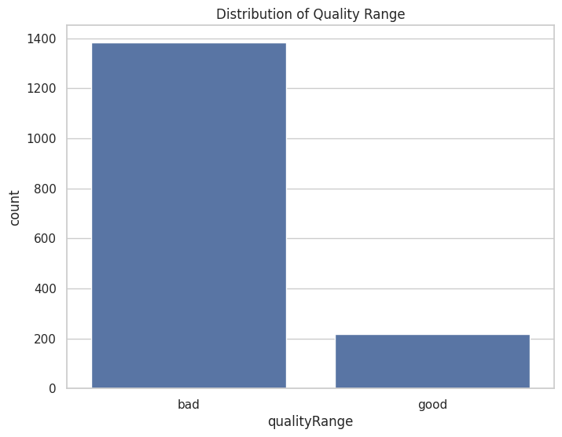

# Red Wine Quality

[Link](https://github.com/mattiapezzotti/redWine_ML) alla repo del progetto su Github.
[Link](https://docs.google.com/presentation/d/1yS_XVYV8o1SeP-sSjj_MmTjzXpVmW0dQCYPWyuINcmc/edit?usp=sharing) alla presentazione.


## Membri del Gruppo
Il Gruppo è formato da:
- Mattia Pezzotti (885965) - m.pezzotti3@campus.unimib.it
- Thomas Howard-Grubb (869248) - t.howardgrubb@campus.unimib.it
- Alaa Eddine Ghanimi (856573) - a.ghanimi@campus.unimib.it

## Introduzione al Dataset
[Link](https://www.kaggle.com/datasets/uciml/red-wine-quality-cortez-et-al-2009) al dataset su Kaggle.

Il dataset Red Wine Quality comprende una serie di proprietà fisiche e chimiche che rappresentano le caratteristiche dei vini rossi e che vengono utilizzate per determinarne la qualità.

Il dataset è relativo alla variante rossa del vino portoghese "Vinho Verde"; è stato chiesto a diversi esperti di valutare diverse tipologie di vino di diverse cantine e di dare un voto da 0 (pessimo) a 10 (eccellente).

Ogni osservazione contiene 11 diverse proprietà chimiche e il relativo punteggio di qualità.

## Variabili
**Acidità Fissa**: influenza il sapore del vino. Una riduzione significativa degli acidi può portare a vini dal sapore piatto. Esempi di acidi fissi sono il tartarico, il malico, il citrico e il succinico, che si trovano nell'uva (tranne il succinico). Si misura in g/dm3.

**Acidità Volatile**: la quantità di acido acetico presente in un vino. Viene espressa in g/l. Secondo gli esperti, rappresenta un difetto se presenta in quantità superiore a 0,7 g/l.

**Acido Citrico**: La quantità di acido citrico presente nel vino, la cui maggior parte viene solitamente consumata durante il processo di fermentazione. Agisce come conservante e piccole quantità possono aggiungere freschezza e sapore. Si misura in g/l.

**Residuo Zuccherino**: La quantità di zucchero che rimane al termine della fermentazione più quello che viene aggiunto (se viene aggiunto). L'obiettivo è ottenere un perfetto equilibrio tra dolcezza e asprezza. Si misura in g/l. I vini con più di 50 g/l sono considerati *dolci*, sotto i 10 g/l sono considerati *secchi*.

**Cloruri**: La quantità di sale presente nel vino in g/l.

**Anidride Solforosa Libera**: La quantità di anidride solforosa (SO2) in forma libera. Una quantità eccessiva è indesiderabile e dà un odore pungente. Si misura in g/dm3.

**Anidride Solforosa Totale**: La quantità totale di SO2 nel vino. Viene aggiunta per uccidere i batteri nocivi e preservare la qualità e la freschezza. Si misura in mg/l ed è regolamentata dallo Stato.

**Densità**: Si usa come misura della conversione dello zucchero in alcol. I vini più dolci hanno una densità maggiore.

**Ph**: Descrive il grado di acidità o basicità di un vino su una scala che va da 0 (molto acido) a 14 (molto basico).

**Solfiti**: La quantità di sali minerali contenenti zolfo nel vino. È un additivo che può contribuire ai livelli di anidride solforosa (S02) e agisce come antimicrobico e antiossidante. Sono legati al processo di fermentazione e influenzano l'aroma e il sapore del vino.

**Gradazione Alcoolica**: L'alcol si forma come risultato della conversione dello zucchero da parte del lievito durante il processo di fermentazione. Viene solitamente misurato in % di volume o in volume alcolico (ABV).

**Qualità**: Valutazione di qualità che va da 0 (pessimo) a 10 (eccellente). È la mediana di almeno tre valutazioni effettuate da esperti di vino su quel vino.

## Prima esplorazione
Esploriamo il dataset:

```python
df.head(10)
```

| # | fixed acidity | volatile acidity | citric acid | residual sugar | chlorides | free sulfur dioxide | total sulfur dioxide | density | pH   | sulphates | alcohol | quality |
|:-:|:-------------:|:----------------:|-------------|----------------|-----------|---------------------|----------------------|---------|------|-----------|---------|---------|
| 0 |      7.4      |       0.70       |     0.00    |       1.9      |   0.076   |         11.0        |         34.0         |  0.9978 | 3.51 |    0.56   |   9.4   |    5    |
| 1 |      7.8      |       0.88       |     0.00    |       2.6      |   0.098   |         25.0        |         67.0         |  0.9968 | 3.20 |    0.68   |   9.8   |    5    |
| 2 |      7.8      |       0.76       |     0.04    |       2.3      |   0.092   |         15.0        |         54.0         |  0.9970 | 3.26 |    0.65   |   9.8   |    5    |
| 3 |      11.2     |       0.28       |     0.56    |       1.9      |   0.075   |         17.0        |         60.0         |  0.9980 | 3.16 |    0.58   |   9.8   |    6    |
| 4 |      7.4      |       0.70       |     0.00    |       1.9      |   0.076   |         11.0        |         34.0         |  0.9978 | 3.51 |    0.56   |   9.4   |    5    |
| 5 |      7.4      |       0.66       |     0.00    |       1.8      |   0.075   |         13.0        |         40.0         |  0.9978 | 3.51 |    0.56   |   9.4   |    5    |
| 6 |      7.9      |       0.60       |     0.06    |       1.6      |   0.069   |         15.0        |         59.0         |  0.9964 | 3.30 |    0.46   |   9.4   |    5    |
| 7 |      7.3      |       0.65       |     0.00    |       1.2      |   0.065   |         15.0        |         21.0         |  0.9946 | 3.39 |    0.47   |   10.0  |    7    |
| 8 |      7.8      |       0.58       |     0.02    |       2.0      |   0.073   |         9.0         |         18.0         |  0.9968 | 3.36 |    0.57   |   9.5   |    7    |
| 9 |      7.5      |       0.50       |     0.36    |       6.1      |   0.071   |         17.0        |         102.0        |  0.9978 | 3.35 |    0.80   |   10.5  |    5    |

```python
df.info()
```
|  # |        Column        | Non-Null Count |  Dtype  |
|:--:|:--------------------:|:--------------:|:-------:|
|  0 |     fixed acidity    |  1599 non-null | float64 |
|  1 |   volatile acidity   |  1599 non-null | float64 |
|  2 |      citric acid     |  1599 non-null | float64 |
|  3 |    residual sugar    |  1599 non-null | float64 |
|  4 |       chlorides      |  1599 non-null | float64 |
|  5 |  free sulfur dioxide |  1599 non-null | float64 |
|  6 | total sulfur dioxide |  1599 non-null | float64 |
|  7 |        density       |  1599 non-null | float64 |
|  8 |          pH          |  1599 non-null | float64 |
|  9 |       sulphates      |  1599 non-null | float64 |
| 10 |        alcohol       |  1599 non-null | float64 |
| 11 |        quality       |  1599 non-null |  int64  |

```python
df.isnull().sum()
```
|  # |        Column        | Null Count |
|:--:|:--------------------:|:----------:|
|  0 |     fixed acidity    |      0     |
|  1 |   volatile acidity   |      0     |
|  2 |      citric acid     |      0     |
|  3 |    residual sugar    |      0     |
|  4 |       chlorides      |      0     |
|  5 |  free sulfur dioxide |      0     |
|  6 | total sulfur dioxide |      0     |
|  7 |        density       |      0     |
|  8 |          pH          |      0     |
|  9 |       sulphates      |      0     |
| 10 |        alcohol       |      0     |
| 11 |        quality       |      0     |

Il dataset non presenta elementi nulli.

```python
df.duplicated().sum()
``` 
```cmd
240
``` 

Questo significa che ci sono 240 entry duplicate, questo tuttavia non significa che i dati siano inutili, semplicemente ci dice che in quelle osservazioni diversi giudici hanno dato lo stesso voto di qualità a uno stesso vino.

```python
df.describe().T
``` 

|                      |  count |    mean   |    std    | min     | 25%     | 50%      | 75%       | max       |
|:--------------------:|:------:|:---------:|:---------:|---------|---------|----------|-----------|-----------|
|     fixed acidity    | 1599.0 |  8.319637 | 1.741096  | 4.60000 | 7.1000  | 7.90000  | 9.200000  | 15.90000  |
|   volatile acidity   | 1599.0 |  0.527821 | 0.179060  | 0.12000 | 0.3900  | 0.52000  | 0.640000  | 1.58000   |
|      citric acid     | 1599.0 |  0.270976 | 0.194801  | 0.00000 | 0.0900  | 0.26000  | 0.420000  | 1.00000   |
|    residual sugar    | 1599.0 |  2.538806 | 1.409928  | 0.90000 | 1.9000  | 2.20000  | 2.600000  | 15.50000  |
|       chlorides      | 1599.0 |  0.087467 | 0.047065  | 0.01200 | 0.0700  | 0.07900  | 0.090000  | 0.61100   |
|  free sulfur dioxide | 1599.0 | 15.874922 | 10.460157 | 1.00000 | 7.0000  | 14.00000 | 21.000000 | 72.00000  |
| total sulfur dioxide | 1599.0 | 46.467792 | 32.895324 | 6.00000 | 22.0000 | 38.00000 | 62.000000 | 289.00000 |
|        density       | 1599.0 |  0.996747 | 0.001887  | 0.99007 | 0.9956  | 0.99675  | 0.997835  | 1.00369   |
|          pH          | 1599.0 |  3.311113 | 0.154386  | 2.74000 | 3.2100  | 3.31000  | 3.400000  | 4.01000   |
|       sulphates      | 1599.0 |  0.658149 | 0.169507  | 0.33000 | 0.5500  | 0.62000  | 0.730000  | 2.00000   |
|        alcohol       | 1599.0 | 10.422983 | 1.065668  | 8.40000 | 9.5000  | 10.20000 | 11.100000 | 14.90000  |
|        quality       | 1599.0 |  5.636023 | 0.807569  | 3.00000 | 5.0000  | 6.00000  | 6.000000  | 8.00000   |

Notiamo subito che, nonostante i voti potessero essere da 0 a 10, esistono solo voti tra il 3 e l'8. Analizziamo meglio *quality*.

### Studio della qualità
    
```python
df["quality"].value_counts()
``` 

| quality | count |
|:-------:|-------|
|    3    | 10    |
|    4    | 53    |
|    5    | 681   |
|    6    | 638   |
|    7    | 199   |
|    8    | 18    |


Come vediamo, c'è un forte **central bias**, i giudici non si esponevano troppo nelle loro valutazioni e tendevano a giudicare con un valore centrale.
Per questo possiamo dire che un vino è **Buono** se è di qualità *6.5* o superiore.

Possiamo studiare la qualità in due modi:
- *Singolarmente*, quindi utilizzando i valori originali
- *Categorizzando*, avendo solo 6 qualità contigue, possiamo unire a due a due, trasformando la qualità in "scadente" (3-4), "normale" (5-6), "ottimo" (7-8).

#### Studio utilizzando le sei qualità

```python
df.corr()['quality']
```

|        quality       | correlation  |
|:--------------------:|-----------|
|        alcohol       | 0.476166  |
|       sulphates      | 0.251397  |
|      citric acid     | 0.226373  |
|     fixed acidity    | 0.124052  |
|    residual sugar    | 0.013732  |
|  free sulfur dioxide | -0.050656 |
| pH                   | -0.057731 |
| chlorides            | -0.128907 |
| density              | -0.174919 |
| total sulfur dioxide | -0.185100 |
| volatile acidity     | -0.390558 |


Notiamo che ci sono delle **forti correlazioni** tra alcuni elementi e la qualità del vino, cosa che noi non vogliamo avere.


Notiamo che ci sono notevoli **Outlier** tra alcuni elementi, cosa che noi non vogliamo avere.

#### Studio con categorie

```python
df["qualityRange"] = pd.cut(df["quality"], bins=[-np.inf, 4, 6, np.inf], labels=["3-4","5-6","7-8"])
```


## PCA
Il dataset è ovviamente di grande dimensioni (11), cerchiamo di trovare quali sono effettivamente utili cosi da ridurne la complessità.
Per evitare che le correlazioni tra variabili possano influenzare i risultati, prima di applicare PCA, standardizziamo i risultati e riduciamo la dimensione del dataset.

```python
scaler = StandardScaler()
scaled_data = scaler.fit_transform(df[columns])

x_train, x_test, y_train, y_test = train_test_split(scaled_data, qualityColumn, test_size = 0.25, random_state=42)

pca = PCA(n_components=None)
    
x_train = pca.fit_transform(x_train)
x_test = pca.transform(x_test)
explained_variance = pca.explained_variance_ratio_
```

La **explained variance** è quindi:

```python
[0.27590, 0.17191, 0.13659, 0.11815, 0.09029, 0.06029, 0.05433, 0.03969, 0.031056, 0.01621, 0.00555]
```

Studiando i risultati in un grafico:


Vediamo come non tutte le componenti sono fondamentali per lo studio della qualità del vino, potendo quindi ridurre le componenti da 11 a 6.

```python
newDF = PCA(n_components=6).fit_transform(scaled_data)
```

# Previsione quality usando DecisionTree e SVM

Possiamo utilizzare il lavoro svolto fino ad ora per allenare dei modelli che riescano a prevedere se un vino è "good" (quality da 7-8) o "bad" (quality da 3-6).

## Preparazione dataframe

Come primo step dobbiamo aggiungere al dataframe pcaData l'attributo qualityRange:
```python
quality_mapping = {
    3: "bad",
    4: "bad",
    5: "bad",
    6: "bad",
    7: "good",
    8: "good"
}

df["qualityRange"] = quality_df["quality"].map(quality_mapping).astype('category')
newdf = pd.concat([pcaData, df['qualityRange']], axis=1)
```
Così facendo otteniamo newdf che rappresenta pcaData con l'aggiunta del nuovo attributo "qualityRange".

### Ribilanciamento del dataframe

Eseguendo un count sui valori di "qualityRange" osserviamo che il dataframe è molto sbilanciato:


Per risolvere eseguiamo SMOTE (Synthetic Minority Over-sampling Technique) per fare oversampling. Meglio eseguire un oversampling rispetto a undersampling in modo da non avere perdita perdita di informazione. Abbiamo scelto SMOTE perchè crea dati nuovi ipotetici, senza copiare quelli che già abbiamo.

```python
from imblearn.over_sampling import SMOTE

X = newdf.iloc[:, :-1]
y = newdf['qualityRange']

smote = SMOTE()
X_train_resampled, y_train_resampled = smote.fit_resample(X, y)
```

Eseguendo un count sui valori di "qualityRange" osserviamo che il dataframe ora è bilanciato:


Possiamo quindi inziare ad allenare dei modelli.

## DecisionTree

Iniziamo allenando un modello di albero decisionale usando il nostro dataframe.
Divideremo il set di dati in 3 parti:
-training set (0.3 del dataframe)
-validation set (0.3 del dataframe rimanente)
-test set (il restante dataframe)

```python
X_train, X_temp, y_train, y_temp = train_test_split(X_train_resampled, y_train_resampled, test_size=0.3, random_state=10)
X_val, X_test, y_val, y_test = train_test_split(X_temp, y_temp, test_size=0.3, random_state=10)
```
Alleniamo il modello come segue:

```python
from sklearn.tree import DecisionTreeClassifier
from sklearn.model_selection import train_test_split
from sklearn.metrics import classification_report


tree_classifier = DecisionTreeClassifier(random_state=10)

tree_classifier.fit(X_train, y_train)

y_train_pred = tree_classifier.predict(X_train)

y_val_pred = tree_classifier.predict(X_val)

y_test_pred = tree_classifier.predict(X_test)

print("Training Set Performance:")
print(classification_report(y_train, y_train_pred))

print("Validation Set Performance:")
print(classification_report(y_val, y_val_pred))

print("Test Set Performance:")
print(classification_report(y_test, y_test_pred))
```

Otteniamo i seguenti risultati:

Training Set Performance:
              precision    recall  f1-score   support

         bad       1.00      1.00      1.00       957
        good       1.00      1.00      1.00       977

    accuracy                           1.00      1934
   macro avg       1.00      1.00      1.00      1934
weighted avg       1.00      1.00      1.00      1934

Validation Set Performance:
              precision    recall  f1-score   support

         bad       0.91      0.84      0.87       303
        good       0.84      0.91      0.87       278

    accuracy                           0.87       581
   macro avg       0.87      0.87      0.87       581
weighted avg       0.88      0.87      0.87       581

Test Set Performance:
              precision    recall  f1-score   support

         bad       0.89      0.89      0.89       122
        good       0.90      0.89      0.89       127

    accuracy                           0.89       249
   macro avg       0.89      0.89      0.89       249
weighted avg       0.89      0.89      0.89       249


